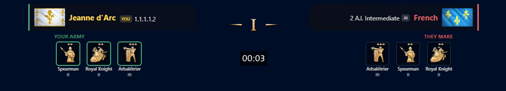
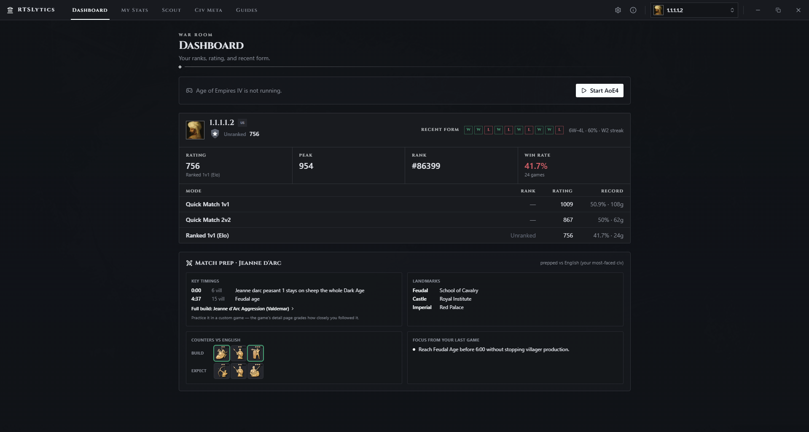
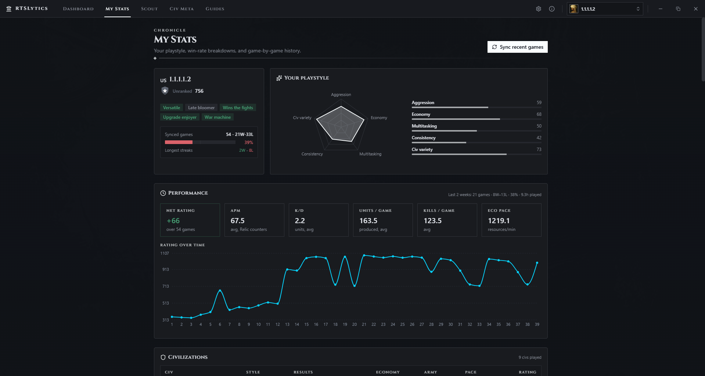
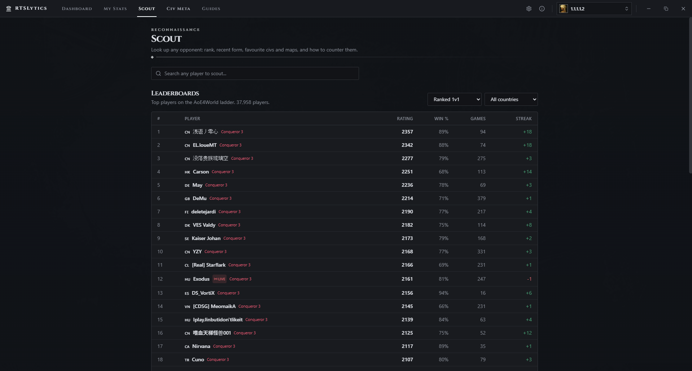
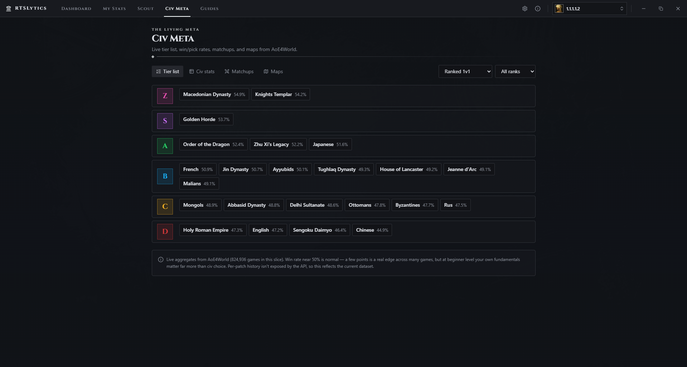
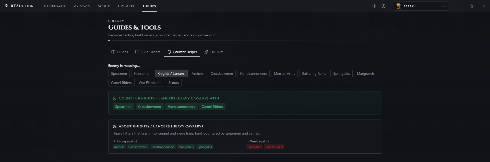

# RTSLytics

[](https://github.com/alesxxxx/AOE4-Analytics/actions/workflows/ci.yml)
[](LICENSE)


Age of Empires IV companion for scouting, overlay help, and post-game stats.

RTSLytics is read-only. It uses public APIs and your own local AoE4 files.

## Features

- Pre-game scouting: opponent rank, rating, recent form, favorite civs, and matchup notes.
- In-game overlay: top matchup bar, civ flags, ranks, key units, counters, and optional live APM.
- Live match clock widgets: a step-by-step build-order guide (pin any build from Guides) and age-up pace targets for your rank, driven by the real game clock (your own log file, pauses included).
- Post-game review: result card, economy grade, APM, trends, and game history.
- Guides and data: civ pages, tier lists, counters, build orders, landmarks, and matchup stats.
- Local support: ranked, Quick Match, custom games, and vs-AI where local files provide the data.

## Screenshots

<p align="center">
  <br>
  <sub><b>In-game overlay</b> — your build order vs theirs, hard-counters ringed</sub>
</p>

<table>
  <tr>
    <td width="50%"><br><sub><b>Dashboard</b> — ranks, rating, recent form, match prep</sub></td>
    <td width="50%"><br><sub><b>My Stats</b> — playstyle radar, performance, rating over time</sub></td>
  </tr>
  <tr>
    <td width="50%"><br><sub><b>Scout</b> — ladder leaderboard and opponent lookup</sub></td>
    <td width="50%"><br><sub><b>Civ Meta</b> — live tier list and win rates</sub></td>
  </tr>
  <tr>
    <td colspan="2" align="center"><br><sub><b>Guides</b> — build orders, counter helper, civ quiz</sub></td>
  </tr>
</table>

## Download

Use the latest portable Windows release:

https://github.com/alesxxxx/AOE4-Analytics/releases/latest

Download `RTSLytics-*-portable.exe` and run it. No installer is required.

## Requirements

- Windows for the full overlay and local-file features.
- Node.js 22 (see [`.nvmrc`](.nvmrc)) and npm for development.

## Development

```bash
npm install
npm run dev
```

Useful commands:

```bash
npm run typecheck
npm run lint
npm test
npm run pack
npm run dist
```

`npm run dist` builds the portable `.exe` in `release/`.

## Overlay

Run AoE4 in Borderless or Windowed Fullscreen. The overlay appears when RTSLytics detects a live match.

Hotkeys (defaults — rebindable in Settings → Overlay):

```text
Alt + O           show / hide overlay
Ctrl + Alt + O    move overlay widgets (placement mode)
```

## Local Data

On Windows, RTSLytics reads files under:

```text
Documents\My Games\Age of Empires IV
```

Used files include logs, session data, match history, and replay headers. This data stays on your machine. RTSLytics makes network requests only to AoE4World, the Relic community API, and — if you connect Steam — Steam and its stat-summary blob host. See [Privacy & security](#privacy--security).

## Data Sources

- Relic community API for scouting and match data.
- AoE4World API for search, ladder data, tier lists, matchups, and maps.
- Vendored AoE4World data and flags.
- Local AoE4 files for live detection and post-game stats.

## Steam sign-in (optional)

Connecting Steam is optional and only used to download your own ranked post-game stat summaries (exact economy, age-up timings) from Relic. QR approval is the recommended method. If you use password sign-in, your password is sent only to Steam for that one login and is never stored; the saved session token is encrypted with your OS keychain.

## Privacy & security

RTSLytics is read-only and keeps your game data on your machine.

## Architecture

RTSLytics is an Electron app with three windows across two processes: a Node **main** process (`electron/`) that owns all IO and the API clients, a typed **preload** bridge (`electron/ipc/contract.ts`), and two React **renderers** — the dashboard (`src/renderer/main/`) and the transparent overlay (`src/renderer/overlay/`). The real logic lives in a pure, Vitest-tested domain layer (`src/domain/`); the renderer only talks to the main process through IPC. See [CONTRIBUTING.md](CONTRIBUTING.md) for the full map.

## Contributing

Contributions are welcome — code, build orders, and guides. Please read [CONTRIBUTING.md](CONTRIBUTING.md) first (especially the read-only rule), and run `npm run typecheck && npm run lint && npm test` before opening a PR.

## Docs

- [CONTRIBUTING.md](CONTRIBUTING.md) — build instructions, the architecture map, and how to contribute

## License

RTSLytics' own source code is licensed under the [MIT License](LICENSE). Bundled Age of Empires IV game data and civilization flag images are © Microsoft and used for non-commercial purposes under Microsoft's Game Content Usage Rules — they are not covered by MIT. See [NOTICE](NOTICE) for details.

## Legal

RTSLytics is not affiliated with Microsoft, Relic Entertainment, or World's Edge. Age of Empires IV and related assets belong to Microsoft and are used under Microsoft's Game Content Usage Rules.
